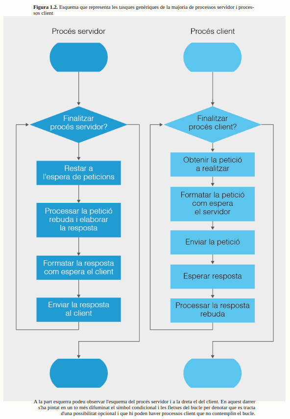
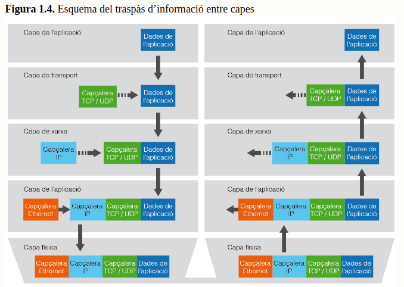
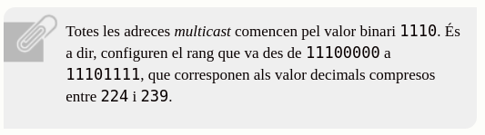

# 1. Programació de comunicacions en xarxa

- Quin és l'objectiu principal de les xarxes?
  - És el d'interconnectar diversos dispositius per tal de compartir totalment o parcialment els seus recursos

- def. protocols:
  - especificacions que defineixen quin ha de ser el comportament de les diferents parts d’un sistema. En concret, els protocols de comunicació a través de la xarxa descriuen el paper de tots els elements de la xarxa (siguin físics o lògics) implicats en la intercomunicació.

- def. aplicació distribuïda:
  - aquella que s’executa en més d’un dispositiu

- def. aplicació distribuïda transparent:
  - aquella aplicació distribuïda que no necessita un tractament especial pel fet d’estar distribuïda o, si més no, el redueix considerablement

- com s'aplica el concepte de transparència des del punt de vista del programador?
  - s’aplica en referència a la menor quantitat de codi que caldrà escriure fent servir eines i biblioteques que automatitzin els processos bàsics de comunicació dins la xarxa

## 1.1. Aspectes teòrics de la comunicació

- def. comunicació:
  - procés complex en el qual es produeix una transferència d’informació entre agents independents

- què implica que la comunicació es produeixi entre agents independents?
  - implica que cada agent disposa del seu propi sistema d’informació que no comparteix de forma directa ni simple amb cap altre agent

- què és necessari per tal que la comunicació sigui possible?
  - que els agents comparteixin una mateixa manera de representar la informació tot i que aquesta no té perquè coincidir amb la representació interna que cada agent manté

- com s'anomena la part de la informació que es transmet?
  - missatge

- def. codificació:
  - procés de representar la informació d’una manera concreta


## 1.2. Rols client i servidor

- quina és la forma més clàssica de comunicar dispositius digitals?
  - aplicant el model client-servidor

- def. servidor:
  - dispositiu que conté informació a compartir amb altres agents anomenats clients, però no sap quan els clients necessitaran la seva informació

- què fa el servidor quan li arriba el missatge?
  - aquest detecta que la petició és per ell, la interpreta, genera la resposta adient i l’envia al client peticionari. Un cop resolta la demanda, el servidor quedarà de nou a l’espera de noves peticions

- quina diferència hi ha entre el rol del servidor amb el del receptor?
  - el servidor a més de rebre les peticions dels clients les ha de processar, obtenir-ne una resposta i enviar-la de tornada al client



## 1.3. Bases de la comunicació entre aplicacions

- què és segurament el que ha propiciat el creixement de l'ús de les xarxes?
  - la senzillesa sobre la qual la commutació de paquets suporta la seva connectivitat

### 1.3.1. Arquitectura d'Internet: una estructura de capes

- def. processos d'una comunicació:
  - són aquells que permeten als dispositius generar, transmetre i rebre un conjunt de senyals seqüenciats d’acord amb una convenció comuna de manera que el receptor sigui capaç d’interpretar allò que l’emissor vol comunicar

- quins elements constitueixen la capa més baixa de la comunicació?
  - per a la generació, la transmissió i la recepció dels senyals es fan servir elements físics com ara les targes de xarxes o els cables

- què aconsegueixen les capes física i la d'enllaç?
  - aconsegueixen aglutinar bona part dels processos rutinaris de la comunicació i eliminar tota la complexitat atribuïble a la generació, recepció i transmissió dels senyals. Això allibera a les capes superiors d’una tasca de certa complexitat i permet així, simplificar la seva implementació

- quina capa es troba per sobre de la capa d'enllaç?
  - trobem la capa que gestiona l’adreçament entre nodes distants. Aquesta capa s’anomena també capa de xarxa

- quines 3 capes han d'estar disponibles en qualsevol dels nodes de la xarxa global per tal de gestionar la transmissió d'informació entre dispositius?
  - les capes física, enllaç i xarxa

- de què s'encarrega el protocol IP?
  - s’encarrega només de l’adreçament dels paquets transmesos, però no pas del control de la transmissió

- de què s'encarrega la capa transport?
  - s’implementa només sobre nodes terminals (dispositius origen i destí), mai sobre els nodes intermedis de la xarxa. Aquesta característica presenta certs avantatges i desavantatges. El principal avantatge és el fet d’abaratir els dispositius intermedis, ja que la implementació d’un protocol de control presenta un grau de dificultat realment molt més elevat que la simple implementació del protocol IP. També presenta l’avantatge de poder usar diversos protocols de control, ja que només hi estan implicats els nodes finals. És a dir, només cal posar d’acord dos nodes abans d’iniciar la transmissió.

- TCP:
  - acrònim de Transmission Control Protocol i UDP d’User Datagram Protocol
  - és un protocol molt més sofisticat que el UDP ja que gestiona el control de l’ordre i també la pèrdua de paquets a més de la integritat de la informació

- UDP:
  - és un protocol de control força senzill, només controla la integritat dels paquets enviats. Això vol dir que l’utilitzen aquelles aplicacions que no necessiten mantenir cap ordre en l’arribada de la informació i en la qual ni la pèrdua d’alguna dada impedeix el normal funcionament


### 1.3.2. Capçaleres i dades

- per què la quantitat d'informació enviada pot acabar superant àmpliament la quantitat de dades originals?
  - cada capa afegeix informació extra que serà útil per la gestió

- per què en el procés en que la informació rebuda ascendeix desde les capes baixes implica pèrdua de dades?
  - a cada pas s’elimina la part d’informació específica del nivell en qüestió i només es passa a la capa superior la informació que li és pròpia



### 1.3.3. Contingut de la informació a cada capa

#### Capa de transport

- principals protocols usats en el nivell de capa de transport:
  - UDP i TCP

- què fa servir la capa de transport per identificar les diferents aplicacions que estan escoltant?
  - un número identificador, anomenat port

- què caldrà fer en cada enviament?
  - incloure sempre el valor del port com a dada extra de la capa, així el receptor podrà esbrinar quina és l'aplicació destinatària

- a què és degut la reducció del nombre de ports?
  - és un conseqüència de la següent convenció....


#### Protocol UDP

- def. Algoritmes de suma
  - és aquell que obté un resultat operant sobre una conjunt de bytes, de manera que el valor obtingut no sobrepassa mai un valor màxim i que la probabilitat d’obtenir valors idèntics a partir de conjunts de bytes diferents és el més petita possible

- per què és més senzill el protocol UDP que el TCP?
  - perquè únicament comprova la coherència de les dades rebudes

- què utilitza el protocol UDP per comprovar la coherència de les dades rebudes?
  - UDP utilitza la longitud de les dades i un valor de comprovació anomenat checksum per a realitzar la verificació de la coherència

- d'on s'obté el valor checksum?
  - s’obté a través d’un algoritme de suma que porta el mateix nom


- què fa el protocol UDP durant la rebuda de la informació?
  - extreu les dades de la capçalera i comprova si la longitud i el valor checksum coincideixen amb les dades rebudes

#### Protocol TCP

- quin tipus de protocol hauran de fer servir les aplicacions que necessitin fiabilitat?
  - protocol TCP

- què fa el protocol TCP per assegurar la fiabilitat de la transmissió?
  - manté un diàleg permanent entre emissor i receptor, en el qual ambdós dispositius s’informen d’allò que van enviant i rebent

- què es diu del protocol TCP?
  - està orientat a la connexió perquè manté un diàleg permanent entre l’emissor i el receptor

- què es diu del protocol UDP?
  - no està orientat a la connexió perquè un cop enviades les dades l’emissor es desentén de la transmissió

#### Característiques de la comunicació entre dos dispositius usant el protocol TCP

- per què està pensat el protocol TCP?
  - per comunicar només dos interlocutors

- què hauran d'escollir les aplicacions que necessitin transmetre a múltiples dispositius?
  - hauran d’escollir entre aplicar el protocol UDP, amb el risc de pèrdua d’informació que això suposa, o bé implementar múltiples connexions dos a dos amb les quals poder controlar a través de TCP la transmissió

- què caldrà abans d'iniciar qualsevol transmissió de dades?
  - establir una connexió entre dues màquines

- què caldrà per aconseguir la connexió?
  - caldrà establir un petit diàleg entre ambdós dispositius en el qual un d’ells enviarà un senyal específic anomenat petició. L’inici de la connexió implicarà la reserva d’un port en cada dispositiu destinat exclusivament al diàleg i a la transmissió de les dades entre els dos interlocutors implicats. És per això que el protocol exigeix que ambdós dispositius s’enviïn mútuament un senyal d’acceptació de la connexió indicant que el port està reservat i que la comunicació pot començar. El port es mantindrà reservat fins que un dels interlocutors decideixi abandonar la comunicació iniciant un diàleg per finalitzar la connexió

- per què diem que TCP és un protocol full-duplex?
  - perquè estableix dos canals de comunicació en cada connexió, cada un en un sentit diferent


#### Capa de xarxa

- def. Topologia de xarxa:
  - fa referència a la interconnexió directa que cada node té amb la resta. Diem que dos nodes es troben connectats directament quan poden enviar-se informació sense passar per cap altre node. La topologia influencia el trànsit que la xarxa és capaç de suportar.

- què fa servir la capa de xarxa per aconseguir connectar 2 dispositius de la xarxa amb independència de la distància que hi hagi entre ells?
  - el protocol IP

- què caldrà per aconseguir la connexió?
  - caldrà esbrinar quins nodes intermedis condueixen al dispositiu destí. En cas que hi hagi més d’un camí per arribar-hi, caldrà escollir-ne un. La decisió no és trivial ni absoluta perquè una xarxa de comunicacions no és quelcom immutable. La capacitat de connexió de la xarxes va variant a cada instant depenent d’aspectes tan volàtils com ara la quantitat de trànsit global que hi circuli o les decisions que altres nodes hagin pres amb anterioritat. Per descomptat depenen també d’aspectes estàtics com ara la topologia o l’eficiència dels recursos físics.

#### Adreçament IP

- def. adreces IP:
  - identifiquen les connexions directes d’un dispositiu de manera única. Un dispositiu pot disposar d’una o diverses connexions a través de les quals enviar i rebre els missatges. En tractar-se d’un valor únic a tota la xarxa s’utilitzen també per identificar els dispositius, malgrat que en realitat un dispositiu tindrà sempre tants identificadors com connexions tingui.

- com es coneixen generalment les connexions directes?
  - es coneixen com a interfícies de xarxa i s’identifiquen amb les targes de xarxa. Malgrat tot, a vegades s’opta per fer emulacions a través del programari. És el que es coneix com a interfícies de xarxa lògiques.

#### Col·laboració entre nodes

- què fan els nodes?
  - col·laboren entre ells creant petits mapes a la xarxa per tal de poder decidir cap on adreçar els paquets que arriben des de diferents orígens a través de les seves interfícies de xarxa. A vegades els nodes demanen als seus veïns que s’identifiquin explicitant la seva adreça IP. Això els permet crear petites llistes associades a cada una de les interfícies. També és comú informar als veïns de les llistes d’adreces que un node és capaç de cobrir, indicant a més la llunyania a la qual es troben les diferents adreces IP de la llista. Per últim, el nodes disposen també de certes regles d’adreçament prefixades que ajuden a acabar de prendre les decisions d’adreçament dels paquets.

- què són els nodes súper-hubs?
  - nodes amb moltes connexions, de manera que la probabilitat que aconsegueixin resoldre l’adreçament és molt més gran que la majoria de les alternatives restants

- quin objectiu tenen les regles que permeten determinar si una adreça IP es troba o no dins d'un rang determinat?
  - tenen com a objectiu segmentar la xarxa i crear mapes específics per a cada node per tal de poder establir un conjunt de regles senzilles que determinin quina interfície de sortida serà la millor opció per transmetre un paquet cap al seu destí.

#### Adreces i màscares

- def. adreces IP:
  - seqüència de bits sobre la qual es poden fer operacions binàries

- def. màscara:
  - seqüència de bits de la mateixa mida que una adreça IP, però organitzada de manera peculiar. Hi ha un nombre indeterminat de bits més significatius (els que es troben més a l’esquerra de la seqüència binària) que sempre prenen el valor 1, mentre que la resta de bits, els menys significatius (que localitzem a la dreta del conjunt d’uns) prenen sempre el valor 0.


- def. adreça IP base:
  - és aquella que, combinada amb una màscara, permet definir un rang d’adreces IP de forma jeràrquica. És a dir, el rang de totes les adreces que comencin pel valor de l’adreça base comparant el nombre de bits de valor 1 de la màscara.


- què caldrà per detectar si una adreça pertany o no a un rang determinat?
  - només caldrà realitzar la operació binaria & i comparar el resultat. És a dir, direm que una adreça IP qualsevol (add1) pertany al rang definit per la màscara (masc) i l’adreça base (addb) si addb&masc=add1&masc.


#### Adreces IP especials

- per a què serveix l'adreça 127.0.0.1 ?
  - serveix per redirigir qualsevol petició de xarxa cap al propi dispositiu que fa la petició

- per a què es reserva tot el rang d'adreces que comencen per 127?
  - es reserva com a adreces de bucle o loopback, tal com se els coneix més popularment

- a què equival el valor 255 decimal?
  - al valor 11111111 binari. És a dir, tots els bits que composen el byte prenen el valor 1

- què són les adreces broadcast?
  - adreces que permeten fer l’enviament d’un únic paquet, dirigit a tot el conjunt de dispositius que comparteixin un cert rang d’adreces. Les adreces broadcast s’identifiquen per disposar d’una o més posicions dels bytes menys significatius amb el valor 255.


- adreces multidifusió o multicast:
  - adreces a les quals es poden fer subscripcions. Són adreces que no pertanyen a cap dispositiu concret, però que són controlades per certs dispositius intermedis que anomenem encaminadors o routers. Aquests dispositius poden rebre la petició de qualsevol dispositiu d’afegir la seva adreça IP a la multidifusió de qualsevol paquet dirigit a l’adreça multicast. És a dir, que el router, en detectar l’enviament d’informació dirigida a una adreça broadcast controlada per aquest dispositiu replicarà el paquets rebuts a totes les IP associades a l’adreça multicast.

- quin és l'objectiu del multicast?
  - reduir el trànsit dins d’una xarxa

- per a què es sol reservar el multicast?
  - se sol reservar a empreses de comunicació que requereixin un enviament selectiu però continu de dades, com per exemple els mitjans de comunicació de pagament o fins i tot corporacions educatives que ofereixin streaming d’àudio o vídeo



#### Noms de domini

- per què fem servir el domini?
  - perquè sigui més senzill pels humans recordar la direcció. Els noms de domini tenen la garantia que són únics en tot el món, per això els propietaris poden decidir d’usar-los directament com a nom d’un dispositiu o bé crear subdominis derivats per disposar de més noms

#### Servidors DNS

- de què s'encarrega el DNS?
  - identifica la IP del destió si cal enviar-hi dades

#### Capa d'enllaç i transmissió física del senyal

## 1.4. Elements de programació d'aplicacions en xarxa

### 1.4.1. Adreçament

- classe InetAddress:
  - és una abstracció que ens permet gestionar de forma transparent adreces IP de qualsevol de les dues versions sense necessitat de tenir-ho en compte
  - Internament sempre es treballarà amb la classe corresponent a la versió adient (IPv4 o IPv6), que quedarà amagada al programador per la classe InetAddress
  - Això facilita molt la codificació ja que ens permet fer el mateix tractament amb independència de la versió IP usada.

- com podem instanciar un objecte de la jerarquia InetAddress, tenint en compte que és abstracte?
  - mai hauríem d’instanciar directament un objecte de la jerarquia invocant la sentència new, sinó que cal fer-ho a través d’un dels mètodes static que la classe InetAddress posa a la nostra disposició

- mètodes més comuns de la classe InetAddress:
  - getByName, getAllByName getByAddress getLoopbackAddress i getLocalHost


### 1.4.2. Referències remotes i obtenció de recursos

- com defineix Berners-Lee un recurs?
  - allò que té un identificador

- com podem identificar un recurs del web?
  - podem fer servir una URL (Uniform Resource Locator)

- què indica l'acces?
  - indica en quin dispositiu es troba el recurs i com hi podem accedir. També se’l coneix com a autoritat (en anglès Authority) perquè representa l’autoritat que té drets sobre el recurs.

#### Classes per treballar amb referències a recursos

- de quines 2 classes disposa Java Development Kit (JDK) per poder treballar fàcilment amb recursos remots identificats amb una URL?
  - URL
  - URLConnection

- principals mètodes de les classes anteriors:
  - 

- principals constructors:
  - 


### 1.4.3. Sòcols

- API:
  - acrònim d’Application Programming Interface

- def. sòcols:
  - punt final de la comunicació bidireccional entre dos programes que s’executen a la xarxa

- què defineix l'arquitectura de les xarxes?
  - una pila de capes des de l'aplicació al medi físic per tal de fer factible la transmissió de dades entre programes

- on estarien situats els sòcols?
  - estarien situats a la capa de transmissió i representarien el punt d’accés de les aplicacions a les capes inferiors del sistema

- què són els sòcols en quant a Java?
  - són la utilitat de programació de més baix nivell del llenguatge Java

- a què estan associats els sòcols per tal que sigui possible adreçar-hi informació a través de la xarxa fent servir algun dels protocols sobre IP disponibles (TCP o UDP)?
  - a una IP

- def. sòcols no orientats a connexió:
  - quan utilitzin el protocol UDP

- def. sòcols orientats a connexió:
  - quan utilitzin el protocol TCP

### 1.4.4. Implementació de sòcols no orientats a connexió

- quines 3 classes contempla Java a l'hora de fer implementacions de comunicació no orientada a connexió?
  - Datagram
  - DatagramPacket
  - DatagramSocket


#### DatagramSocket

- de què són capaços d'enviar i rebre els paquets especificats pel protocol UDP:
  - són capaços d’enviar i rebre els paquets especificats pel protocol UDP. En crear una instància podem especificar un port concret que el sòcol escoltarà quan sigui necessari atendre algun servei (estàndard o no) associat al port.

- què farà la classe durant la creació de la instància?
  - cercarà el primer port lliure dins el rang disponible per atendre comunicacions temporals


- objectius de la classe DatagramPacket:
  - representen paquets de dades d’acord a l’especificació definida pel protocol UDP


#### MulticastSocket

- què permet la classe MulticastSocket:
  - amb aquesta classe és possible crear aplicacions que usin adreces multicast


### 1.4.5. Implementació de sòcols orientats a connexió

- quin protocol fan servir els sòcols orientats a connexió?
  - TCP

- què fa el protocol TCP?
  - El protocol TCP defineix que abans de començar la transmissió de dades cal fer una petició de connexió que l’altre part haurà d’acceptar. Un cop acceptada la connexió, en ambdós costats es reservarà un port de xarxa exclusivament per a la transmissió de dades en qualsevol dels dos sentits. Recordeu que TCP és un protocol que defineix una comunicació full-duplex exclusiva entre dos dispositius.

- def. flux (stream):
  - és una abstracció relacionada amb qualsevol procés de transmissió d’informació entre un origen i un destí.

- def. flux de dades:
  - segueix un únic sentit (de l’origen al destí), per tant les aplicacions que necessitin transmetre i rebre hauran de fer servir dos fluxos, un en cada sentit

- com es diu el flux que rep dades des d'un origen extern?
  - flux d’entrada (input stream en anglès)

- com es diu el flux que envia informació a un destí exterior?
  - flux de sortida (output stream en anglès)

- què contenen els objectes de tipus sòcol?
  - contenen dos fluxos de dades a través d’un d’ells es rebran les dades (flux d’entrada) i a través de l’altre s’enviaran (flux de sortida).

- en aplicacions client-servidor, a què equival el flux de sortida del servidor?
  - al flux d'entrada del client

- en aplicacions client-servidor, a què equival el flux d'entrada del servidor?
  - al flux de sortida del client


#### Creació d'un ServerSocket que atendrà el port 7777 a l'espera de clients que demanin comunicar-se

```java
ServerSocket serverSocket = new ServerSocket(7777);
```

#### Creació d'un sòcol en un client que vulgui comunicar-se amb un servidor que es trobi atenent el port 7777 a l'adreça 192.168.4.1

```java
Socket socket = new Socket(new InetAddress.getByName("192.168.4.1"), 7777);
```

#### Mètode accept

- què fa el mètode accept?
  - accept resta a l’espera d’una petició i en el moment de produir-se crea una instància específica de sòcol per suportar la comunicació amb el client acceptat

```java
Socket socket = serverSocket.accept();
```

- què usarem per enviar o rebre dades?
  - els mètodes propis dels fluxos

- què implicarà la recepció de les mateixes dades enviades a través del flux d'entrada de l'altre sòcol?
  - l'enviament a través del flux de sortida


#### esquema del procediment seguit per connectar amb un servidor TCP de Java


# EXERCICIS


