# 2. Programació multifil

- què permet la programació multifil?
  - permet dur a terme diferents fils d’execució a la vegada, és a dir, permet realitzar diferents tasques en una aplicació de forma concurrent

## 2.1. Els fils

- com està dissenyada per treballar la programació tradicional?
  - de forma seqüencial
  - quan acaba un procés, se'n posa en marxa un altre

- què permeten els fils?
  - executar paral·lelament diferents parts d'un mateix programa

### 2.1.1. Definició de fil

- def. fil o thread:
  - és la unitat de processament més petita que pot ser planificada per un sistema operatiu

- què ens permeten els fils?
  - executar concurrentment diferents tasques amb una despesa mínima de recursos ja que tots els fils d’un mateix procés comparteixen l’espai de memòria i la seva creació consumeix poc temps de processador

- per què els fils son entitats lleugeres?
  - perquè comparteixen l'espai de memòria i la seva creació consumeix poc temps de processador

- què hi ha en un procés?
  - un o diversos fils en execució

- què representen els fils?
  - les execucions de les instruccions d'un programa que es duen a terme simultàniament en el context d'un mateix procés

### 2.1.2. Relació procés i fil

- els processos comparteixen memòria entre ells?
  - NO, són independents, porten informació sobre el seu estat i interactuen amb altres processos a través de mecanismes de comunicació donats pel sistema

- què passa si un fil modifica una dada en la memòria?
  - que la resta de fils tenen accés a la nova dada de forma inmediata

- què succeeix quan un procés finalitza?
  - tots els seus fils també ho fan

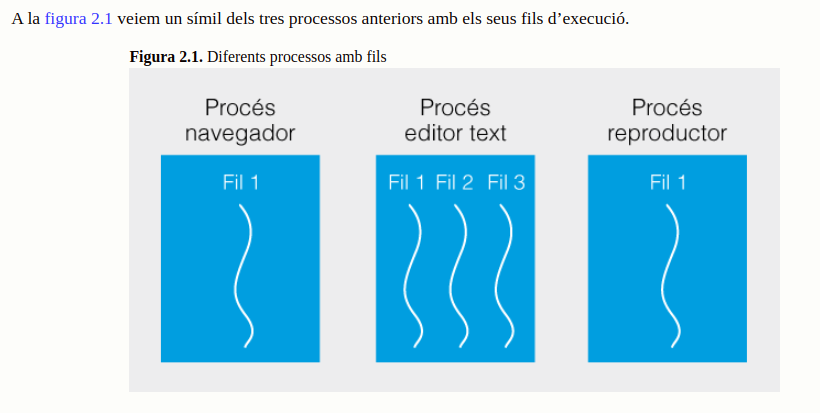

### 2.1.3. Els fils a Java

- què succeeix quan comencem un programa en Java?
  - hi ha un fil en execució, el fil principal, que és creat pel mètode main()

- per què és molt important el fil principal?
  - perquè és l'encarregat, si cal, de crear la resta de fils del programa

```java
// EXEMPLE : quan s'executa el main, s'imprimeixen els diferents valors de x , passa en un únic fil d'execució

package filexecuciounic;
public class FilExecucioUnic {
    public static void main(String[] args) {
        for (int x=0;x<10;x++)
        System.out.println("x=" + x);
    }
}
```

- on defineix Java la funcionalitat principal de la gestió dels fils?
  - a la classe Thread

- què permet fer la classe Thread?
  - crear i executar nous fils, aturar-los, reprendre’n l’execució, esperar la finalització dels fils creats, etc.

- constructors de la classe Thread:
  - Thread(): reserva memòria per crear un objecte Thread.
  - Thread(Runnable target): reserva memòria per la creació d’un nou objecte de la classe Thread el qual gestionarà l’execució de l’objecte Runnable passat per paràmetre.
  - Thread(Runnable target, String name): reserva memòria per la creació d’un nou objecte de la classe Thread el qual gestionarà l’execució de l’objecte Runnable passat per paràmetre. L’objecte creat es podrà identificar amb el nom passat en el segon paràmetre
  - Thread(String name): reserva memòria per crear un objecte Thread identificat amb el nom passat per paràmetre.
  - Thread(ThreadGroup group, Runnable target): reserva memòria per un nou objecte Thread que gestionarà l’execució de l’objecte Runnable (target) i que pertany al grup de fils (group).
  - Thread(ThreadGroup group, Runnable target, String name): reserva memòria per un nou objecte Thread identificat amb el nom name, que pertany al grup de fils (group) i que gestionarà l’execució de l’objecte Runnable target.
  - Thread(ThreadGroup group, String name): crea un nou objecte Thread identificat per name i que pertany al grup de fils concret (group)

- mètodes més importants de la classe Thread:
  - 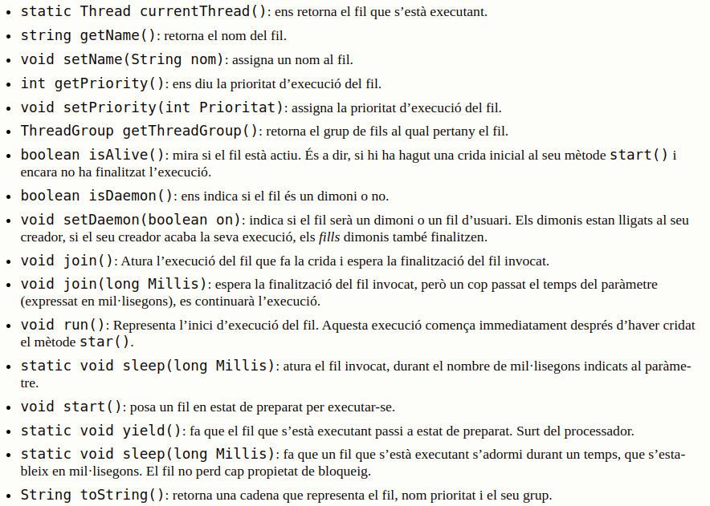

#### La classe Object

- mètodes de la classe Object relacionats amb els fils:
  - 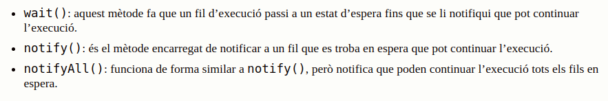

- quan són executats els mètodes anteriors?
  - quan executem la programació concurrent de diferents fils (programació multifil)

- per a què serveixen els mètodes anteriors:
  - serveixen per fer esperar un fil que un altre acabi de fer alguna tasca. També que, un cop acabada aquesta tasca, notifiqui al fil en espera que pot continuar la seva execució

- on es poden cridar aquest mètodes únicament?
  - fins de mètodes sincronitzats

```java
synchronized public void metodeSincronitzat(){
   //...
}
```
```java
public void metode(){
   synchronized (this) {
      //....
     }
//...
}
```

## 2.2. Gestió de fils

### 2.2.1. Creació i execució d'un fil

- 2 formes de creació de fils a Java:
  - a) Heretant la classe Thread
  - b) Implementant la interfície Runnable

- quin mètode té la classe Thread que caldrà que sobreescrivim per codificar les instruccions a processar durant l'execució del fil?
  - run() (public void run())

- quin mètode caldrà cridar per invocar el processament d'un fil?
  - start()

```java
// EXEMPLE de creació d'una classe que hereta de la classe Thread
// Les seves instàncies seran fils
// El constructor de la classe rep un String que serà la paraula que volem imprimir
// Al mètode run() implementem el codi que permetrà imprimir 5 vegades la paraula

package heretafil;

public class HeretaFil extends Thread {

  String strImprimir;
  public HeretaFil(String strP) {
    strImprimir=strP;
  }

  public void run(){
    for(int x=0;x<5;x++){
      System.out.println(strImprimir+ " " + x);
    }

  }

  public static void main(String[] args) {

    Thread primer = new HeretaFil("Fil 1");
    Thread segon = new HeretaFil("Fil 2");
    // Hem creat dos fils primer i segon, però no s'han executat.
    // Per poder-lo executar s'ha de cridar al mètode start()
    primer.start();
    segon.start();

    System.out.println("Final Fil Principal");

  }
}
```
```java
// Creació de dos objectes de tipus HeretaFil que són fils
    Thread primer = new HeretaFil("Fil 1");
    Thread segon = new HeretaFil("Fil 2");
```
```java
// Posem els fils creats en execució cridant al mètode start()
// Es fa una inicialització del fil i el deixa a l'organitzador de fils
// Quan l'organitzador ho decideix es crida al mètode run() que executa el codi
        primer.start();
        segon.start();
```

- què caldrà fer si volem que el nostre fil hereti d'una altra classe a part de la de Thread?
  - com que Java no permet herència múltiple, haurem de fer servir la interface Runnable
  - La classe Thread conté un constructor que ens permet passar-li com a paràmetre qualsevol objecte que implementi la interfície Runnable: Thread (Runnable unFil)

```java
// Exemple de creació de fils que hereten de la classe Runnable

package runnablefil;

public class RunnableFil implements Runnable {

  String strImprimir;
  public RunnableFil(String strP) {
    strImprimir=strP;
  }

  public void run(){
    for(int x=0;x<5;x++){
      System.out.println(strImprimir+ " " + x);
    }

  }

  public static void main(String[] args) {

    //Creem dos objecte de la classe RunnableFil 
    RunnableFil objRunnable1 = new RunnableFil("Fil 1");
    RunnableFil objRunnable2 = new RunnableFil("Fil 2");
    //Creem dos Fils i li passem per paràmetres els objecte de la classe RunnableFil 
    Thread primer = new Thread(objRunnable1);
    Thread segon = new Thread(objRunnable2);
    // Hem creat dos fils primer i segon, però no s'han executat.
    // Per poder-lo executar s'ha de cridar al mètode start()
    primer.start();
    segon.start();

    System.out.println("Final Fil Principal");

  }
}
```

- com podem evitar que el programa principal (el fil principal) finalitzi l'execució abans que els fils creats per ell?
  - usant el mètode de la classe Thread anomenat sleep() que deixa el fil en estat de suspens durant cert tempe
  - també podriem usar el mètode join() que permet fer que el fil pare esperi que els fils fills acabin

### 2.2.2. Estats i canvis d'estat d'un fil

- cicle de vida d'un fil:
  - 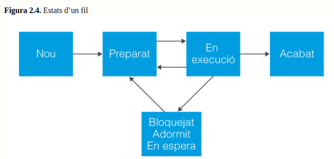

- descripció imatge anterior:
  - Nou és l’estat en què es troba un fil quan ha estat creat amb el mètode new()
  - El mètode start() posa el fil en estat de preparat. Encara no està en execució, si no que està preparat per utilitzar el processador si l’organitzador de fils ho troba oportú.
  - Si l’organitzador li indica que passa a fer ús del processador, entra en l’estat d’en execució.
  - De l’estat d’execució pot passar a un estat de bloquejat, adormit o en espera per diferents motius. En aquests estats un fil no s’executa ni es troba a la cua dels fils en espera d’execució.
  - Quan algun esdeveniment el desbloquegi o arribi la hora de despertar-se, el fil transitarà a l’estat de preparat per tornar a ser executat.
  - Direm que un fil està viu (alive), mentre transiti entre els estats preparat, en execució, bloquejat, adormit o en espera.
  - Quan un fil finalitzi la seva execució arribant al final dl mètode run, passarà a l’estat d’acabat i direm que està mort (dead), perquè des d’aquest estat no podrà tornar-se a executar més.

- motius pels que un fil que està en execució pot sortir de l'execució:
  - 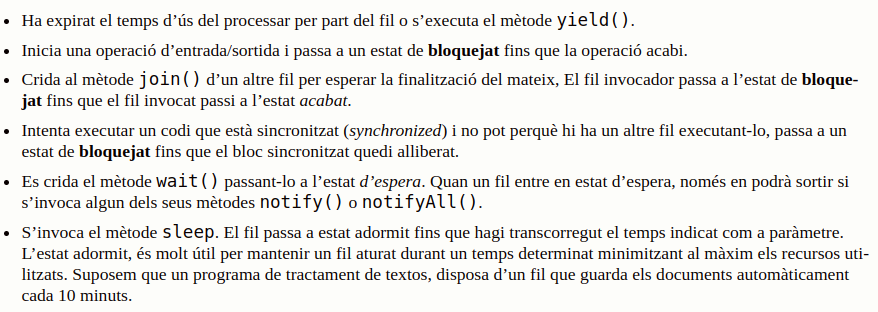

- canvi d'estat d'un fil:
  - 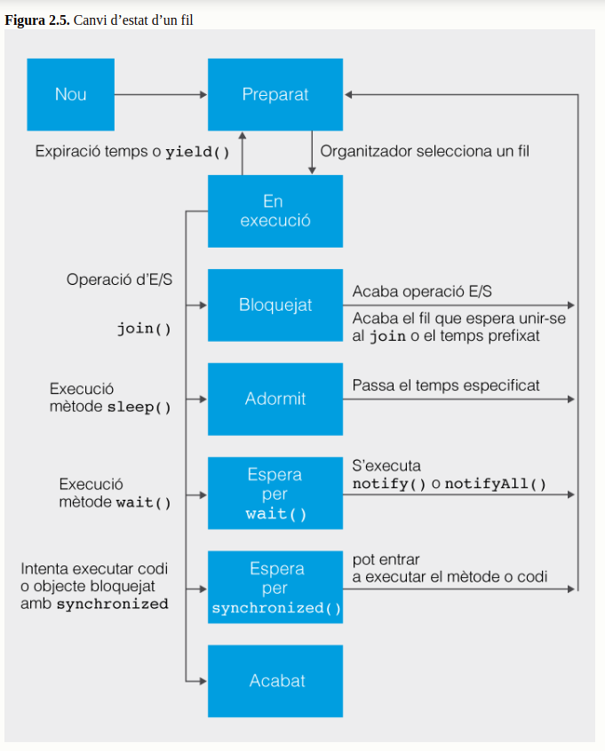

### 2.2.3. Mètode thread.join()

- què permet el mètode no estàtic join() de la classe thread?
  - permet que un fil d’execució esperi a un altre. Dit d’una altra manera, la classe thread permet, a través del mètode join(), que un fil s’uneixi al final de la seva execució a un altre fil.

- què hem de fer si tenim un fil A que no pot completar la seva feina fins que el fil B hagi acabat?
  - haurem d'unir el fil A al B filA.join(). El fil A estarà bloquejat fins que el B acabi.

```java
// creació de 3 fils i cada un llença un dau
// el programa principal ha de mostrar el resultat de la suma

package joinfils;

class TiradaDaus {
  private int tiradaDau;

  public TiradaDaus (int e) {
    tiradaDau=e;
  }

  public synchronized int getSumaTirada() {
    return tiradaDau;
  }

  public synchronized void setSumaTirada(int e) {
    tiradaDau += e;
  }
}


public class JoinFils implements Runnable {

  private TiradaDaus xobj;

  public JoinFils(TiradaDaus m) {
    xobj=m;
  }
  public void run(){
    try{
      Thread.sleep(1000);
      int resultatDau=(int) (Math.random()*6) + 1;
      xobj.setSumaTirada(resultatDau);
      System.out.println("Tirada fil "+Thread.currentThread().getName() +": " +resultatDau);
    }catch (InterruptedException e){
    }
  }

  public static void main(String[] args) throws InterruptedException {
    TiradaDaus ans=new TiradaDaus(0);

    JoinFils obj1 = new JoinFils(ans);
    JoinFils obj2 = new JoinFils(ans);
    JoinFils obj3 = new JoinFils(ans);
    Thread fil_1 = new Thread(obj1);
    fil_1.setName("Dau 1");
    Thread fil_2 = new Thread(obj2);
    fil_2.setName("Dau 2");
    Thread fil_3 = new Thread(obj3);
    fil_3.setName("Dau 3");
    fil_1.start();
    fil_2.start();
    fil_3.start();
    fil_1.join(); //Espera el fil_1 que el fil principal, el que l'ha invocat acabi
    fil_2.join();
    fil_3.join();

    System.out.println("Total tirada: "+ ans.getSumaTirada());
    System.out.println("Final Fil Principal");

  }

}
```
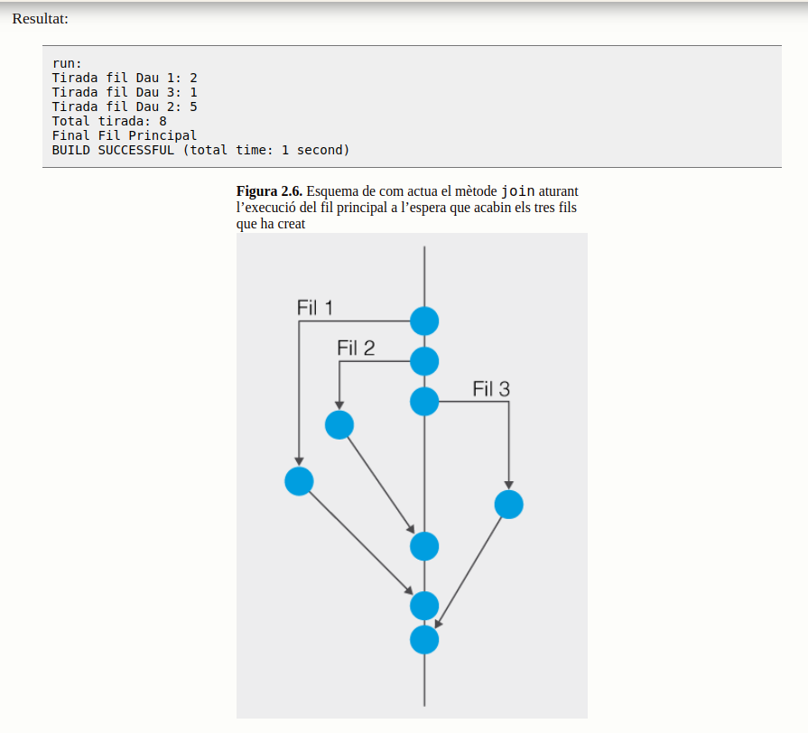

- en l'exemple anterior, hem d'esperar que els 3 fils acabin l'execució:
  - el fil principal ha d'esperar per acabar la seva execució quan els seus fills acabin

```java
    fil_1.join(); 
    fil_2.join();
    fil_3.join();
```

- què passaria si el fil principal no espera que hagin acabat la seva execució els seus fills en l'exemple anterior?
  - que el resultat podria ser erroni

## 2.3. Sincronització de fils

### 2.3.1. Mètodes synchronized

- què caldrà que fem si volem protegir els objectes d'una classe de possibles interferències a un entorn multifil?
  - haurem de posar el modificador synchronized als mètodes de la secció crítica

- què garanteix el modificador synchronized?
  - que cap altre mètode sincronitzat de l’objecte podrà executar-se

- què passa quan un fil executa un mètode sincronitzat?
  - agafa el bloqueig de l’objecte fins que acaba la seva execució i s’allibera del bloqueig. Si altre fil crida el mètode sincronitzat del mateix objecte, queda bloquejat fins que quedi el fil que l’està executant l’alliberi del bloqueig

- esquema de bloqueig-alliberar mètode sincronitzat:
  - 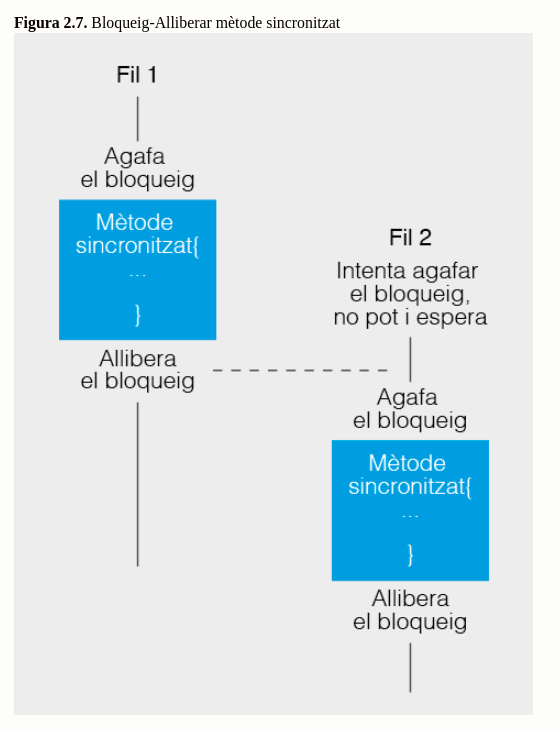

- quina és la forma natural d'alliberar un bloqueig?
  - que el fil arribi al final del codi del mètode o trobi una sentència return.
  - també pot alliberar-lo per altres motius, com ara que es llanci una excepció

```java
// Exemple de com sincronitzem alguns mètodes d'una classe i d'altres no.
// Els que volem que s'executin en exclusió mútua els sincronitzem amb la paraula reservada synchronized

public class sincronitzaMetodes {

  public void metodeNoSincronitzat_1(){
//.........
  }

  public synchronized void metodeSincronitzat_1(){
//.........
  }
  public synchronized void metodeSincronitzat_2(){
//.........
  }
  public void metodeNoSincronitzat_2(){
//.........
  }
}
```

- què fa el mètode sleep(milisegons) ?
  - deixa el fil en estat de bloquejat durant un temps marcat en milisegons i un cop passat aquest temps torna a l’estat de preparat. Durant aquest temps si el fil tenia el bloqueig d’un objecte, el continuarà tenint. No perd el bloqueig durant aquest temps

### 2.3.2. Objectes synchronized

- què fem quan sincronitzem mètodes?
  - estem bloquejant aquests mètodes per tal que únicament un fil pugui executar-los a la vegada. Però si sincronitzem molt, tots els avantatges que ens proporciona la concurrència es perden. Per tant, hem de sincronitzar únicament aquell codi que ens interessa

```java
// exemple de com es sincronitza una part del codi sobre l'objecte que ha cridat al mètode

class Sincronitzat {

  public void metodeNoSincronitzat(){
    //Part de codi no sincronitzat

    synchronized (this){
      //Codi sincronitzat
    }

    //Part de codi no sincronitzat

  }
}
```

```java
public class AgenciaViatges implements Runnable {

    private SeientsAvio sa = new SeientsAvio();
    public void run(){
        //Codi no sincronitzat
       System.out.println("Seients Lliures: " + sa.getSeientsLliures());
       synchronized(sa){
                gestioSeientsAvio(3);
                if(sa.getSeientsLliures()<=0)
                   System.out.println("No hi ha seients lliures");
         }
//Codi no sincronitzat

}
    
    public  void gestioSeientsAvio(int numSeientsReserva){
//….
}
```

### 2.3.3. Sincronitzar mètodes estàtics
```java
public static void metodeNoSincronitzat() {
//Codi no sincronitzat
Class lmc = Class.forName("LaMevaClasse");
synchronized(lmc) {
//Codi sincronitzat
}
//Codi no sincronitzat
}
```

### 2.3.4. Variables volatile

```java
class mètodeExemple {
private bolean valor = false;
public void cambiarValor () {
valor = true;
}
public class classeExemple {
    
    private boolean flag = false;
    
    public void cambiarFlag(){
        flag=true;
    }
    
    public synchronized void metodeExemple () {
        flag = false;
        // un altre fil prodria cridar al mètode cambiarFlag()
        if (flag) {
            // …
        }
     }
 }
```

- què aporta declarar la variable flag com a volatile?
  - que la màquina virtual de java sàpiga que un altre fil pot modificar aquest valor

### 2.3.5. Interbloqueig

- a tenir en compte:
  - només hem de sincronitzar aquells mètodes o blocs de codi necessaris, ja que abusar de la sincronització penalitza el rendiment de l’aplicaciónomés hem de sincronitzar aquells mètodes o blocs de codi necessaris, ja que abusar de la sincronització penalitza el rendiment de l’aplicació
  - si no sincronitzem correctament es podem produir errors

```java
public class FerTransferencia {
    private static class CompteCorrent {
        //Codi de la classe
        }
        private CompteCorrent transferenciaA = new CompteCorrent();
        private CompteCorrent transferenciaB = new CompteCorrent();
         
        public int metodeTransferenciaArxius() {
        synchronized(transferenciaA) { // Possible interbloqueig
        synchronized(transferenciaB) {
        //Codi del mètode
        }
        }
        }
        public void metodeTransferenciaCalers() {
        synchronized(transferenciaB) { // Possible interbloqueig
        synchronized(transferenciaA) {
        //Codi del mètode
        }
        }
    }
}
```

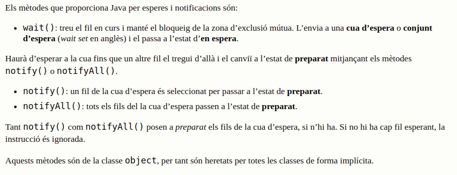

- on s'han d'executar els mètodes wait(), notify() i notifyAll()?
  - han d’executar-se sobre el fil que té el bloqueig. Per tant, totes les crides a aquests mètodes s’han de fer des de mètodes o blocs de codi sincronitzats

```java
synchronized void metodeWait () {
    while (!condicio)
        try {
        wait();
        }
        catch (InterruptedException e) {
        // codi d’excepció
        }
    // codi que s’executa quan la condició és certa.
    }
     
    synchronized void metodeCanviCondicio(boolean valor) {
    condicio = valor;
    notify(); // o notifyAll()
}
```

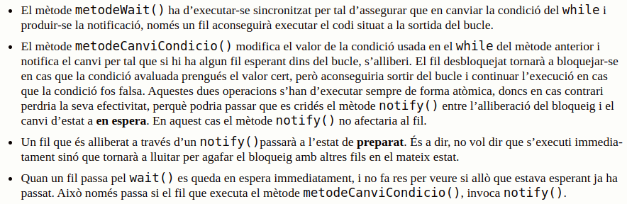

```java
package holaadeum;
 
public class HolaAdeuM {
    public static void main(String args[]) {
    escriuHolaAdeu eha = new escriuHolaAdeu();
    new E_Adeu(eha);
    new E_Hola(eha);
    }
    }
     
     
    class E_Hola implements Runnable {
    escriuHolaAdeu eh;
    E_Hola (escriuHolaAdeu eh) {
    this.eh = eh;
    new Thread(this, "Hola").start();
    }
    public void run() {
    try{
    for(int x=0;x<5;x++) {
    Thread.sleep(1000);
    eh.eHola();
    }
    }catch (InterruptedException e){
    }
    }
    }
     
    class E_Adeu implements Runnable {
    escriuHolaAdeu eh;
    E_Adeu (escriuHolaAdeu eh) {
    this.eh = eh;
    new Thread(this, "Adéu").start();
    }
    public void run() {
    for(int x=0;x<5;x++) {
    eh.eAdeu();
    }
    }
    }
     
    class escriuHolaAdeu {
     
    boolean escritHola = false;
     
    public synchronized void eAdeu() {
    while (escritHola == false) {
    try {
    wait();
    } catch (InterruptedException e) {
    }
    }
    escritHola = false;
    System.out.println(" Adéu ");
    }
     
    public synchronized void eHola() {
    System.out.println(" Hola ");
    escritHola = true;
    notify();
    }
 
}
```

## 2.4. Compartir informació entre fils

### 2.4.1. Mètodes wait(), notify() i notifyAll()

```java
package holaadeum;
 
public class HolaAdeuM {
    public static void main(String args[]) {
    escriuHolaAdeu eha = new escriuHolaAdeu();
    new E_Adeu(eha);
    new E_Hola(eha);
    }
}
 
class E_Hola implements Runnable {
    escriuHolaAdeu eh;
    E_Hola (escriuHolaAdeu eh) {
    this.eh = eh;
    new Thread(this, "Hola").start();
    }
    public void run() {
    try{
    for(int x=0;x<5;x++) {
    Thread.sleep(1000);
    eh.eHola();
    }
    }catch (InterruptedException e){
    }
    }
    }
     
    class E_Adeu implements Runnable {
    escriuHolaAdeu eh;
    E_Adeu (escriuHolaAdeu eh) {
    this.eh = eh;
    new Thread(this, "Adéu").start();
    }
    public void run() {
    for(int x=0;x<5;x++) {
    eh.eAdeu();
    }
    }
    }
     
    class escriuHolaAdeu {
     
    boolean escritHola = false;
     
    public synchronized void eAdeu() {
    while (escritHola == false) {
    try {
    wait();
    } catch (InterruptedException e) {
    }
    }
    escritHola = false;
    System.out.println(" Adéu ");
    }
     
    public synchronized void eHola() {
    System.out.println(" Hola ");
    escritHola = true;
    notify();
    }
 
}
```

### 2.4.2. Productor-consumidor

- en què consisteix el model productor - consumidor?
  - es tracta d’un fil (productor)que genera una sortida que és agafada per un altre fil (consumidor)

```java
class Monitor {
 
private int numero = 0;
    void Monitor(){
    numero=0;
    }
     
    public synchronized int afagar() {
    return( numero );
    }
     
    public synchronized void deixar( int num ) {
    numero = num;
    }
}
```

```java
class Productor implements Runnable {
private Monitor safata;
 
public Productor( Monitor s ) {
    safata = s;
    }
    private int numero =0;
     
    public void run() {
     
    // Posa 10 lletres a la canonada
    for( int i=0; i < 5; i++ ) {
    numero= (int)(10*Math.random());
    safata.deixar(numero);
    System.out.println( "Produït el número "+numero );
    try {
    Thread.sleep( (int)(Math.random() * 1000 ) );
    } catch( InterruptedException e ) {;}
    }
    }
}
```
```java
class Consumidor implements Runnable {
 
private Monitor safata;
 
public Consumidor( Monitor s ) {
    safata = s;
    }
     
     
    public void run() {
    int num;
     
    for( int i=0; i < 5; i++ ){
    num = safata.afagar();
    System.out.println( "Número agafat: "+num );
    try {
    Thread.sleep( (int)(Math.random() * 2000 ) );
    } catch( InterruptedException e ) {;}
    }
    }
}
```

## 2.5. Agrupació de fils

### 2.5.1. Agrupació per defecte i creació de grups

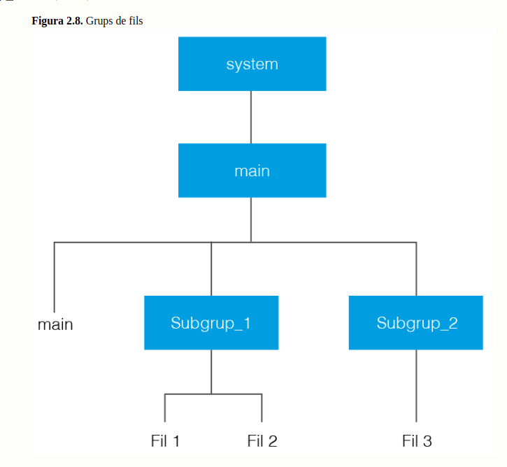

### 2.5.2. Classe ThreadGroup

- què conté la classe ThreadGroup?
  - conté tota la funcionalitat per la manipulació de grups de fils

- què ens diu el mètode activeGroupCount()?
  - els grups que hi ha actius

- què ens diu el mètode currentThread().getThreadGroup()?
  - com es diu el grup del fil actiu

- què ens diu el mètode list()?
  - dóna els detalls del grup actiu i els seus subgrups (nom, prioritat...)

## 2.6. Gestió de fils per part del sistema operatiu

### 2.6.1. Planificació de fils

- característiques més importants de la planificació de fils:
  - Tots els fils tenen assignada una prioritat i l’encarregat de decidir quin fil s’executa ha de garantir que els fils amb prioritat més alta tinguin preferència. Però això no implica que en un moment donat un fil amb prioritat més baixa estigui executant-se.
  - S’ha de garantir que tots els fils s’executin en algun moment.
  - El temps assignat a cada fil per fer ús del processador pot aplicar-se o no depenent del sistema operatiu en el qual s’executa la màquina virtual.

### 2.6.2. Prioritat de fils

- com podem establir el rang de prioritats dels fils?
  - MIN_PRIORITY
  - MAX_PRIORITY
  - NORM_PRIORITY

- què fa el mètode setPriority()?
  - permet modificar la prioritat d’un fil

```java
fil.setPriority(8);
```

- què fa el mètode getPriority()?
  - torna la prioritat d'un fil

```java
System.out.println(“Prioritat fil “ +  fil.getPriority());
```

### 2.6.3. Fils dimonis

- què aporta que al crear un fil, abans de cridar al mètode start() indiquem que serà executat com un dimoni (daemon)?
  - permetrà al fil executar-se a un segon pla

- def. garbage collector:
  - és un dimoni creat per la màquina virtual de Java, que s’encarrega d’alliberar memòria ocupada per objectes que no estan referenciats

- què hem de fer si volem crear fils que no siguin daemon?
  - ho hem d'indicar expressament amb setDaemon (false)

````java
package filsdimonis;
import java.io.IOException;
 
public class FilsDimonis extends Thread{
    private static final int MIDA = 10;
    private Thread[] fils = new Thread[MIDA];
    public FilsDimonis(){
    setDaemon(true);
    start();
    }
    public void run(){
    for(int i = 0; i<MIDA; i++){
    fils[i]= new CrearDimoni(i);
    }
    for(int i=0; i<MIDA; i++){
    System.out.println("fils[" + i + "].isDaemon() = " + fils[i].isDaemon() );
    }
    while(true) yield();
    }
     
    class CrearDimoni extends Thread{
    public CrearDimoni(int i){
    //si un fil no ens interessa que sigui dimoni, ho hem d'indicar aquí
    //setDaemon(false); abans del mètode start()
    //en cas contrari, hereta la qualitat de dimoni del seu pare.
     
    System.out.println("Dimoni creat " + i );
    start();
    }
    public void run(){
    while (true) yield();
    }
    }
     
    public static void main(String[] args) throws IOException{
    Thread fil = new FilsDimonis();
    System.out.println("isDaemon() = " + fil.isDaemon() );
    System.out.println("Pica una tecla per finalitzar");
    System.in.read();
    }
}
````

## 2.7. Documentació d'aplicacions i depuració d'aplicacions multifil

### 2.7.1. Depuració d'aplicacions multifils


