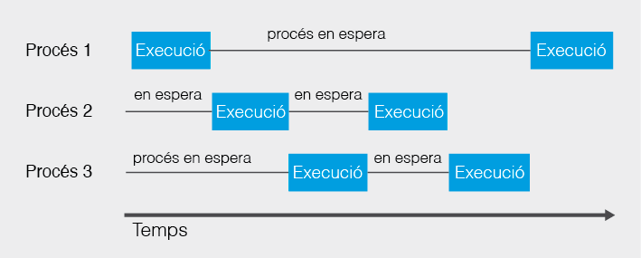
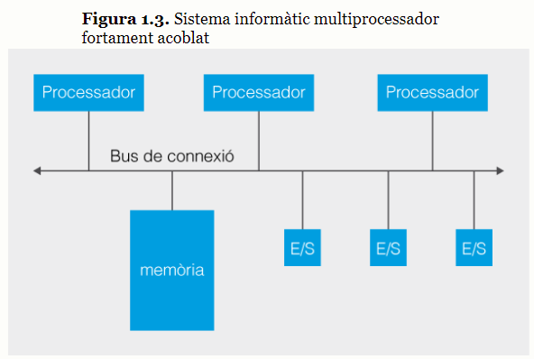
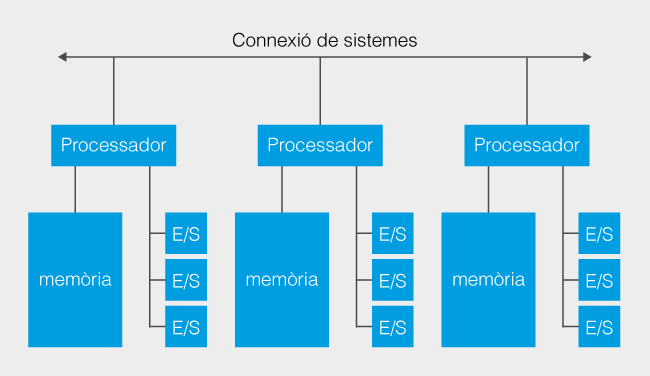
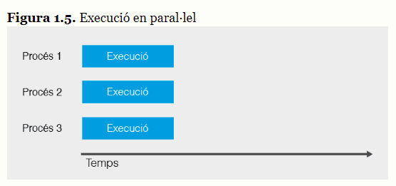
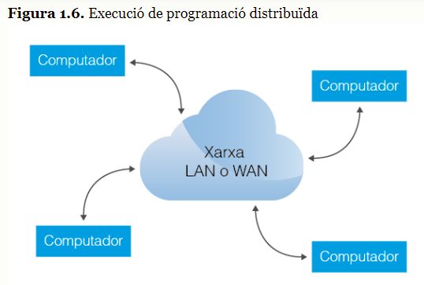
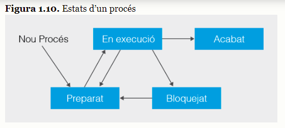
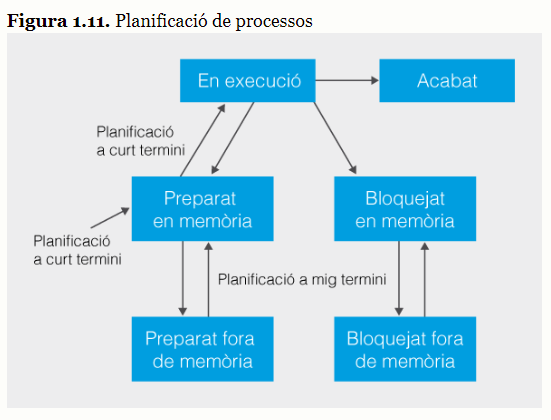
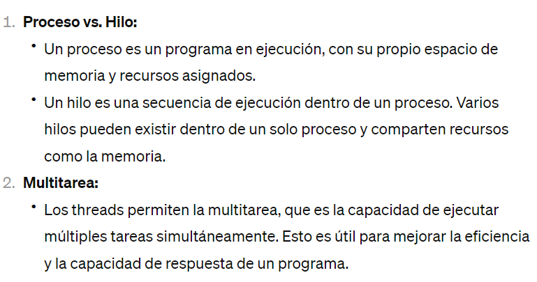
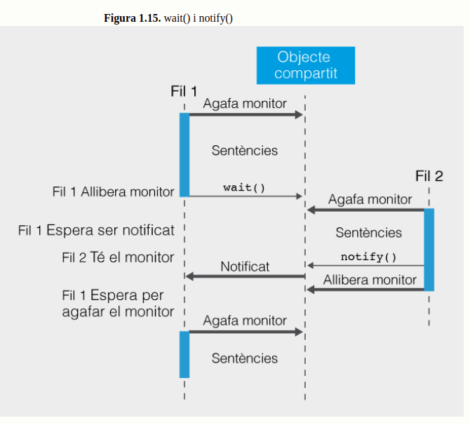

# 1. Programació multiprocés i paral·lela

- def. multiprocés:
    - Ús de diversos processadors per incrementar el nombre de càlculs per unitat de temps.

## 1.1. Programació multiprocés

- def. multiprocés:
    - Executar diversos processos a la vegada.

### 1.1.1. Procés, sistemes monoprocessador-multiprocessador

- def. procés:
    - activitat realitzada pel processador per tal d'elaborar algun complement, seguint les instruccions d'un programa.

- def. programa:
    - element estàtic, un conjunt d’instruccions, unes línies de codi escrites en un llenguatge de programació, que descriuen el tractament que cal donar a unes dades inicials (d’entrada) per aconseguir el resultat esperat (una sortida concreta).

- def. procés:
    - és dinàmic, és una instància d’un programa en execució, que realitza els canvis indicats pel programa a les dades inicials i obté una sortida concreta. El procés, a més de les instruccions, requerirà també de recursos específics per a l’execució com ara el comptador d’instruccions del programa, el contingut dels registres o les dades.

- qui és l'encarregat de gestionar els processos?
    - el sistema operatiu

- què fa el sistema operatiu quan s'executa un programa?
    - el sistema operatiu crea una instància del programa: el procés.

- què passaria si el programa es tornés a executar?
    - es crearia una nova instància totalment independent a l'anterior (un nou procés) amb les seves pròpies variables, piles i registres.

- on es troba un procés quan està en execució?
    - en memòria

- què té assignats un procés que es troba en execució?
    - els recursos que necessita

- on es guarda la informació associada a l'execució d'un procés?
    - a una estructura de dades

- com es diu la zona on es guarda la informació associada a l'execució d'un procés?
    - BCP: Bloc de Control de Procés

- com es diu el component del maquinari d'un sistema informàtic en el qual s'executen els processos?
    - processador

- def. processador:
    - component de maquinari d’un sistema informàtic encarregat d’executar les instruccions i processar les dades.

- def. sistema monoprocessador:
    - és aquell que està format únicament per un processador

- def. sistema multiprocessador:
    - està format per més d’un processador

- què solen fer la major part dels sistemes operatius quan esperen alguna dada de l'usuari o es troben pendents d'alguna operació d'entrada o sortida?
    - aprofiten el temps de repòs dels processos per introduir al processador un altre procés, simulant així una execució paral·lela

- def. processos concurrents:
    - processos que s'executen a la vegada

- qui és l'encarregat de gestionar l'execució concurrent de diferents processos contra un mateix processador?
    - el sistema operatiu

- def. multiprogramació:
    - quan el sistema operatiu gestiona l'execució de processos concurrents a un sistema monoprocessador

- què succeeix quan tenim dos o més processadors?
    - es poden executar diversos processos a la vegada

- com s'anomenen també els processadors que tenen més d'un nucli?
    - multiprocessadors

- de quines 3 maneres podem classificar els sistemes multiprocessadors?
    - sistemes multiprocessador fortament acoblats i sistemes multiprocessador dèbilment acoblats

- def. sistemes multiprocessadors fortament acoblats:
    - els diferents processadors comparteixen una mateixa memòria i estan interconnectats a ella a través d’un bus

- en quins 2 grups de sistemes multiprocés es poden classificar els sistemes multiprocessadors fortament acoblats?
    - sistemes multiprocés simètrics / sistemes multiprocés asimètrics

- def. sistemes multiprocés simètrics:
    - els processadors del sistema són de característiques similars i competeixen entre iguals per executar processos

- def. sistemes multiprocés asimètrics:
    - un dels processadors del sistema, el màster, controla la resta de processadors

- com s'anomena també el màster dels sistemes multiprocés asimètrics?
    - master-slave

- def. sistemes multiprocessadors dèbilment acoblats:
    - no comparteixen memòria, cada processador té una memòria associada. A les execucions que necessiten col·laboració entre processos els cal l’intercanvi de missatges a través d’enllaços de comunicacions, per habilitar la comunicació entre processos. Un tipus d’aquests sistemes poc acoblats són els sistemes distribuïts, en els quals cada dispositiu monoprocessador (o multiprocessador) podria estar situat a llocs físicament distants.

- exemple de sistema dèbilment acoblat distribuït:
    - una xarxa d’ordinadors o Internet

### 1.1.2. Programació concurrent, paral·lela i distribuïda

- def. programació concurrent:
    - quan s’executen en un dispositiu informàtic de forma simultània diferents tasques (processos).

- problemes de l'execució concurrent a l'hora d'accedir a les dades:
    - el bloqueig i la comunicació

- parlem de multiprogramació quan...
    - la programació concurrent es dóna en un computador amb un únic processador

- parlem de programació paral·lela quan...
    - els processos es poden executar de forma realment simultània

- def. programació paral·lela:
    - quan la programació concurrent es realitza en un sistema multiprocessador

- principal desavantatge de la programació paral·lela:
    - els controls que hem d'afegir per tal que la comunicació i sincronització dels processos que s'executen concurrentment siguin correctes

- programació distribuïda:
    - és un tipus de programació concurrent en la qual els processos són executats en una xarxa de processadors autònoms o en un sistema distribuït. És un sistema de computadors independents que des del punt de vista de l’usuari del sistema es veu com una sola computadora.

- avantatges de la programació distribuïda
    - altament escalables / altament reconfigurables / alta disponibilitat

### 1.1.3. Avantatges i desavantatges del multiprocés

- def. programació concurrent o concurrència:
    - tècnica per la qual múltiples processos s’executen alhora i poden comunicar-se entre ells.

- avantatge : incrementar la potència de càlcul i el rendiment:
    - quan s’executen diversos processos a l’hora, la velocitat d’execució global es pot incrementar.

- avantatge : flexible:
    - si augmenten el processos que s’estan executant és capaç de distribuir la càrrega de treball dels processadors, i pot també reassignar dinàmicament els recursos de memòria i els dispositius per ser més eficients

- avantatge : fàcil creixement:
    - si el sistema ho permet, es poden afegir nous processadors de forma senzilla i així augmenten la seva potència

- avantatge : tolerància a fallades:
    - una fallada d’un processador no fa que el sistema s’aturi.

- avantatge : diferenciar processos per la seva especialització:
    - reservar processadors per operacions complexes, aprofitar-ne d’altres per processaments paral·lels i per avançar l’execució

- inconvenient :
    - vénen provocats sobretot pel control que s’ha de realitzar quan hi ha diversos processos en execució i han de compartir informació o comunicar-se. Això incrementa la complexitat de la programació i penalitza el temps d’execució

## 1.2. Processos i serveis

- def. servei:
    - és un tipus de procés que no té interfície amb l’usuari. Poden ser, depenent de la seva configuració, inicialitzats pel sistema de forma automàtica, en el qual van realitzant les seves funcions sense que l’usuari se n’assabenti o bé es poden mantenir a l’espera que algú els faci una petició per fer una tasca en concret

- classificació dels processos depenent de com s'estan executant:
    - processos en primer pla (foreground, en anglès) i processos en segon pla (background)

- def. processos en primer pla:
    - mantenen una comunicació amb l’usuari, ja sigui informant de les accions realitzades o esperant les seves peticions per mitjà d’alguna interfície d’usuari

- def. processos en segon pla:
    - no es mostren explícitament a l’usuari, bé perquè no els cal la seva intervenció o bé perquè les dades requerides no s’incorporen a través d’una interfície d’usuari

- DAEMON:
    - Disk And Execution Monitor

- de quins tipus de processos estem parlant quan parlem de serveis?
    - processos executats en segon pla

- com es diuen els fitxers de registre on els serveis emmagatzemen la informació generada o les possibles errades que es vagin produïnt?
    - logs

### 1.2.1. Fils i processos

- per què els processos s'anomenen entitats pesades?
    - perquè estan a espais de direccionament de memòria independents, de creació i de comunicació entre processos, cosa que consumeix molts recursos de processador

- per què els fils s'anomenen entitats lleugeres?
    - perquè no consumeixen gaire temps de processador

- quan estarà un procés en execució?
    - mentre algun dels seus fils estiguin actius

- def. fil:
    - els fils comparteixen els recursos del procés (dades, codi, memòria, etc.)

- 2 nivells de fils:
    - fils de nivell d'usuari, que són els que creem quan programem amb un llenguage de programació com ara Java
    - fils de segon nivell, que són els que crea el sistema operatiu per donar suport als primers

## 1.3. Gestió de processos i desenvolupament d’aplicacions amb finalitat de computació paral·lela

### 1.3.1. Estats d'un procés

- def. planificador de processos:
    - encarregat de repartir l’ús del processador de la forma més eficient possible i assegurant que tots els processos s’executin en algun moment

- en què es basa el sistema operatiu per realitzar la planificació de processos?
    - es basarà en l’estat dels processos per saber quins necessitaran l’ús del processador

- def. nou:
    - quan un procés és creat

- def. preparat :
    - el procés passa a l'estat preparat

- què segueix el planificador de processos:
    - una política que indica quan un procés ha de canviar d’estat, quan ha de deixar lliure o entrar a fer ús del processador

### 1.3.2. Planificació de processos

- def. planificació de processos:
    - conjunt de protocols o polítiques que decideixen en quin ordre s’executaran els processos al processador. Aquestes polítiques segueixen alguns criteris de prioritat segons la importància del procés, el temps d’utilització del processador, el temps de resposta del procés, etc

- def. planificació a llarg termini:
    - en el moment que es crea un procés es decideixen alguns criteris de planificació, com ara la unitat de temps màxim que un procés podrà romandre en execució (que s’anomena quantum) o la prioritat inicial que se li assignarà a cada procés de forma dinàmica per la utilització del processador

- def. planificació a curt termini:
    - cada vegada que un procés abandona el processador cal prendre la decisió de quin serà el nou procés que entrarà a fer-ne ús. En aquest cas les polítiques intenten minimitzar el temps necessari per aconseguir un canvi de context. Els processos recentment executats solen tenir prioritat però cal assegurar que mai s’exclogui permanentment cap procés de l’execució

- def. planificació a mig termini:
    - existeixen altres parts del sistema operatiu que també són importants a la planificació de processos. En el cas del SWAP de memòria, si es treu un procés de la memòria per problemes d’espai fa que no pugui ser planificable de forma immediata. El planificador a mig termini serà l’encarregat de decidir quan cal portar a la memòria principal les dades dels processos emmagatzemats fora i quines caldrà traslladar de la memòria principal a l’espai d’intercanvi

- def. planificació temporal:
    - en el qual es troba definida la política de planificació que actua sobre cada processador de forma individual, com si fos un sistema monoprocessador. El planificador temporal decideix quan de temps cal dedicar a processar cada procés, quan cal fer canviar, per a quin motiu, etc

- def. planificació espacial:
    - en el qual es defineix com es reparteixen els processos entre els processadors. És a dir, organitza quin processador executa quin procés

### 1.3.3. Programació paral·lela transparent

- quines llibreries de baix nivell proporciona Java que dona suport a la programació concurrent?
    - java.lang.Thread
    - java.lang.Runnable

- quins marcs predefinits de programació paral·lela té el llenguatge Java?
    - Executor
    - fork-join

- què fan les llibreries Executor i fork-join?
    - encapsulen bona part de la funcionalitat i amb ella de la complexitat addicional que la programació de més baix nivell (Threads) presenta

#### Us de patrons per resoldre problemes similars

- def. patrons:
    - solucions genèriques que ens permeten resoldre diversos problemes similars canviant petites coses. L’enginyeria informàtica fa servir aquest concepte per referir-se a biblioteques complexes que permeten un alt grau de configuració malgrat que per això sigui necessari escriure aquelles parts específiques que adaptaran el patró al problema que s’intenti resoldre

- què fa la biblioteca Executor de Java?
    - implementa diversos patrons amb l’objectiu de solucionar de la forma més transparent possible bona part de les situacions en les quals es necessita programació paral·lela. Cada patró s’adapta a diferents situacions per la qual cosa cal saber distingir les situacions i aplicar correctament el patró que calgui

#### Executor

- com podem simplificar la programació paral·lela?
    - dividir un problema en problemes més petits i cadascun d’aquests subproblemes enviar-los a executar per separat. Per tant, d’una tasca complicada en tenim diverses de més simples. Per poder executar en paral·lel totes aquestes subtasques i així augmentar el rendiment, es creen diferents subprocessos o fils, però aquesta creació és totalment transparent pel programador, és la màquina virtual de Java l’encarregada de gestionar la creació de fils per executar en paral·lel les subtasques

- def. Executor:
    - és una millora sobre la creació de fils, ja que s’abstreu de la creació i la gestió dels subprocessos, De fet només cal indicar la tasca o tasques a realitzar de forma paral·lela (instant objectes de tipus Runnable o Callable), escollir el gestor adequat i deixar que aquest s’encarregui de tot

- de quins 3 tipus de gestors disposem en Java per poder simplificar la programació paral·lela?
    - ThreadPoolExecutor: gestor genèric
    - ScheduledThreadPoolExecutor: gestor capaç de seguir pautes temporals d'execució
    - ForkJoinPool: classe que forma part de java.util.concurrent

##### ThreadPoolExecutor

- def. classe ThreadPoolExecutor
  - En Java, la clase equivalente para trabajar con hilos en un entorno similar a un pool de hilos es ExecutorService, y puedes utilizar su implementación específica ThreadPoolExecutor para crear y gestionar un grupo de hilos.
  - classe que permet implementar el gestor genèric
  - per solucionar problemes que es puguin resoldre executant tasques independents entre si, com per exemple si hem de sumar molts números, sumar per paquets i després sumar els resultats de la suma de cada paquet.

- com treballa la classe ThreadPoolExecutor?
  - no crea pas un fil per cada tasca (instància de Callable o Runnable)
  - és habitual assignar-li més tasques que no pas fils. Les tasques pendents romanen en una cua de tasques i un nombre de fils determinat s’encarrega d’anar-les executant
  - La clase ThreadPoolExecutor en Java es una parte del framework de concurrencia introducido en Java 5, ubicada dentro del paquete java.util.concurrent. Esta clase es utilizada para gestionar un grupo de hilos reutilizables para la ejecución de tareas. Permite la ejecución paralela de múltiples tareas en un conjunto limitado de hilos y maneja detalles como la creación de hilos, su vida útil, la cola de tareas y la terminación de hilos de manera eficiente y con un control fino.

- quines 3 formes ràpides ofereix Java per configurar les instàncies de ThreadPoolExecutor fent servir la classe Executors?
  - newCachedThreadPool() : crea un pool que va creant fils a mesura que els necessita i reutilitza els fils inactius
  - newFixedThreadPool(int numThreads) : crea un pool amb un número de fils fix. L’indicat en el paràmetre. Les tasques s’emmmagatzemen en una cua de tasques i es van associant als fils a mida que aquest quedin lliures
  - newSingleThreadExecutor() : crea un pool amb un sol fil que serà el que processi totes les tasques

- de quin mètode disposa la classe ThreadPoolExecutor per introduir una tasca (instància de Runnable o Callable) cada cop?
  - execute

- de quin mètode disposa la classe ThreadPoolExecutor per afegir una llista de diverses tasques?
  - invokeAll

- de quin mètode disposa la classe ThreadPoolExecutor per obtenir el nombre de fils en execució?
  - getPoolSize()

- de quin mètode disposa la classe ThreadPoolExecutor per saber el nombre de tasques finalitzades?
  - getCompleteTaskCount()

- què és ScheduledThreadPoolExecutor?
  - és un cas específic de pool
  - gestor de fils, amb una política d’execució associada a una seqüència temporal. És a dir executa les tasques programades cada cert temps. Pot ser d’una sola vegada o de forma repetitiva

- de quins mètodes disposa la classe ScheduledThreadPoolExecutor per gestionar el retard i la cadència?
  - schedule (Callable task, long delay, TimeUnit timeunit) : crea i executa una tasca (task) que és invocada després d’un temps concret (delay) expressat en les unitats indicades (timeunit).
  - schedule (Runnable task, long delay, TimeUnit timeunit) : crea i executa una acció (task), una sola vegada, després que hagi transcorregut un temps concret (delay) expressat en les unitat indicades (timeunit)
  - scheduleAtFixedRate (Runnable task, long initialDelay, long period, TimeUnit timeunit) : crea i executa una tasca (task) de forma periòdica. La primera vegada s’invocarà després d’un retard inicial (initialDelay) i posteriorment cada període de temps determinat (period). El temps es mesura en les unitats indicades (timeunit)
  - scheduleWithFixedDelay (Runnable task, long initialDelay, long delay, TimeUnit timeunit) : crea i executa una tasca (task) de forma periòdica. La primera vegada s’invocarà després d’un retard inicial (initialDelay) i posteriorment, en acabar la darrera tasca llançada, no es començarà la següent, fins que no hagi passat el temps indicat a delay. El temps es mesura en les unitats indicades (timeunit)

- què retornen els mètodes que reben tasques de tipus Callable?
  - el resultat obtingut durant el càlcul

#### Interface Callable i Future

- què fa la interface Future?
    - conté el valor que es retorna després de l'execució
    - es defineix quan el thread (fil) ha acabat

- què fa la interface Callable?
    - defineix un thread (fil) que retorna un valor

#### Fork-join

- def. marc Fork-join:
  - es un framework diseñado para facilitar el trabajo con tareas paralelas y aprovechar al máximo los procesadores de múltiples núcleos disponibles en un sistema. Introducido en Java 7 dentro del paquete java.util.concurrent, su objetivo principal es permitir el desarrollo fácil y eficiente de operaciones paralelas descomponiendo tareas grandes en tareas más pequeñas de manera recursiva hasta que sean lo suficientemente simples como para ser ejecutadas simultáneamente (el proceso de "fork") y luego combinando los resultados de estas tareas (el proceso de "join")

- def. ForkJoinPool:
  - tipo especial de hilos que son usados por el framework Fork-Join para ejecutar tareas de manera más eficiente
  - este Pool utiliza un algoritmo de robo de trabajo (work-stealing algorithm), lo que significa que los hilos que terminan sus tareas roban tareas pendientes de otros hilos que están ocupados, lo que resulta en un uso de CPU muy eficiente y una menor sobrecarga en la gestión de hilos

- def. classe ForkJoinTask:
  - classe abstracta per les tasques que s'executen a ForkJoinPool

- quins mètodes conté la classe ForkJoinTask?
  - mètode fork
  - mètode join

- mètode fork():
  - situa la tasca invocada a la cua d’execucions en qualsevol moment per tal que sigui planificada. Això permet que a una tasca crear-ne de noves i deixar-les a punt per ser executades quan el gestor ho consideri
  - cuando se llama al método fork sobre una instancia de ForkJoinTask, esta tarea se coloca en la cola de entrada del pool Fork-Join. El sistema está diseñado para usar un algoritmo de robo de trabajo (work-stealing), lo que significa que los hilos del pool que terminan sus tareas buscarán activamente nuevas tareas para ejecutar, tomando tareas pendientes de las colas de otros hilos si es necesario. Esto mejora la eficiencia del uso de los hilos y reduce el tiempo de inactividad, maximizando el rendimiento de la aplicación.

- mètode join():
  - aturarà l’execució del fil invocador a l’espera que la tasca invocada finalitzi l’execució i retorni si fos el cas els resultats
  - se utiliza para esperar y obtener el resultado de una tarea computacional. Después de que una tarea ha sido "forked" (es decir, sometida para su ejecución), el método join() puede ser llamado para esperar a que esa tarea se complete y obtener su resultado

- qué sucede cuando se bloquea el hilo por usar el método join()?
  - se pone en alerta al gestor ForkJoinPool que podrá intervancair la tarea parada por otra que esté en espera

- por qué 2 clases está implementada ForkJoinTask?
  - RecursiveTask
  - RecursiveAction

- què fa la classe RecursiveTask?
  - per tasques que necessitin calcular i retornar un valor

- què fa la classe RecursiveAction?
  - representa procediments o accions que no necessiten retornar cap resultat

- què fa el mètode invokeAll quan el fem servir amb RecursiveAction?
  - fa un invocació de fork per cada una de les tasques rebudes com a paràmetre i seguidament s’espera a la finalització de cada fil amb una crida al mètode join de les tasques engegades

- per què no resulta útil usar invokeAll amb RecursiveTask?
  - perquè invokeAll no retorna cap resultat

#### Algoritmes recursius i algoritmes iteratius

## 1.4. Sincronització i comunicació entre processos

### 1.4.1. Competència de recursos i sincronització 

- com podem classificar els processos concurrents?
  - processos independents / processos cooperants

- def. procés independent:
  - no encessita ajuda ni cooperació d'altres processos

- def. procés cooperant:
  - dissenyat per treballar conjuntament amb altres processos i, per tant, s'han de poder comunicar i interactuar entre ells

- def. sincronització en la programació concurrent:
  - permet que els processos que s’executen de forma simultània es coordinin, aturant l’execució d’aquells que vagin més avançats fins que es compleixin les condicions òptimes per estar segurs que els resultats finals seran correctes

- 3 mètodes per sincronitzar processos:
  - sincronisme condicional / exclusió mútua / comunicació per missatges

- def. sincronisme condicional:
  - o condició de sincronització. Un procés o fil es troba en estat d’execució i passa a estat de bloqueig tot esperant que una certa condició es compleixi per continuar la seva execució. Un altre procés fa que aquesta condició es compleixi i així el primer procés passa de nou a l’estat d’execució.

- def. exclusió mútua:
  - es produeix quan dos o més processos o fils volen accedir a un recurs compartit. S’han d’establir protocols d’execució perquè no accedeixin de forma concurrent al recurs

- def. comunicació per missatges:
  - en la qual els processos s’intercanvien missatges per comunicar-se i sincronitzar-se. És la comunicació típica en sistemes distribuïts i és utiltzada també en sistemes no distribuïts

### 1.4.2. Sincronització i comunicació

#### Seccions crítiques

- def. problema de les seccions crítiques:
  - Tenim diversos processos que s’executen de forma concurrent i cadascun d’ells té una part de codi que s’ha d’executar de forma exclusiva ja que accedeix a recursos compartits com ara fitxers, variables comuns, registres de bases de dades, etc.

- solució pel problema de les seccions crítiques:
  - obligar a accedir als recursos a través de l’execució d’un codi que anomenarem secció crítica i que ens permetrà protegir aquells recursos amb mecanismes que impedeixin l’execució simultània de dos o més processos dins els límits de la secció crítica

- def. algoritme d'exclusió mútua:
  - algoritmes de sincronització que eviten l’accés a una regió crítica per més d’un fil o procés i que garanteixen que únicament un procés estarà fent ús d’aquest recurs i la resta que volen utilitzar-lo estaran a l’espera que sigui alliberat

- def. exclusió mútua (MUTEX, mutual exclusion):
  - tipus de sincronització que impedeix que dos processos executin simultàniament una mateixa secció crítica

- 4 criteris que s'han de complir en qualsevol mecanisme de sincronització d'una secció crítica:
  - Exclusió mútua: no pot haver-hi més d’un procés simultàniament en la secció crítica.
  - No inanició: un procés no pot esperar un temps indefinit per entrar a executar la secció crítica.
  - No interbloqueig: cap procés de fora de la secció crítica pot impedir que un altre procés entri a la secció crítica.
  - Independència del maquinari: inicialment no s’han de fer suposicions respecte al número de processadors o la velocitat dels processos.

#### Productor - consumidor

- def. problema productor-consumidor:
  - exemple clàssic on cal donar un tractament independent a un conjunt de dades que es van generant de forma més o menys aleatòria o si més no d’una forma en què no és possible predir en quin moment es generarà una dada

- solució pel problema productor-consumidor:
  - ampliar la ubicació on el productor escriu les dades de manera que sigui possible mantenir diverses dades a l’espera que siguin consumides mentre els processos consumidors estiguin ocupats. És a dir, els productors emmagatzemaran les dades en un llista (array), que tradicionalment es coneix com a buffer i els consumidors les aniran extraient

- def. interbloqueig:
  - situació extrema que ens trobem quan dos o més processos estan esperant l’execució de l’altre per poder continuar de manera que mai aconseguiran desbloquejar-se

- def. inanició:
  - situació que es produeix quan un procés no pot continuar la seva execució per falta de recursos. Per exemple si féssim créixer el buffer il·limitadament

#### Lectors - escriptors

- def. problema lectors - escriptors:
  - produït quan tenim un recurs compartit entre diversos processos concurrents com poden ser un fitxer, una base de dades, etc. que va actualitzant-se periòdicament. En aquest cas els processos lectors no consumeixen la dada sinó que només la utilitzen i per tant es permet la seva consulta de forma simultània, malgrat que no la seva modificació

- def. processos lectors:
  - processos que accedeixin al recurs compartit per llegir el seu contingut

- def. processos escriptors:
  - processos que accedeixin al recurs per modificar-lo

- solució problema lectors - escriptors:
  - cal assegurar que els processos escriptors accedeixen de forma exclusiva al recurs compartit i que a cada modificació s’avisa als processos lectors interessats en el canvi. Així, els processos lectors poden restar en espera fins que són avisats que hi ha noves dades i poden començar a llegir; d’aquesta manera s’evita que els lectors estiguin constantment accedint al recurs sense que l’escriptor hagi posat cap nova dada, optimitzant, d’aquesta manera, els recursos.

### 1.4.3. Solucions a problemes de sincronització i comunicació

#### Semàfors

- def. semàfors:
  - tècnica de sincronització de memòria compartida que impedeix l’entrada del procés a la secció crítica tot bloquejant-lo. El concepte va ser introduït per l’informàtic holandès Dijkstra per resoldre el problema l’exclusió mútua i permetre resoldre gran part dels problemes de sincronització entre processos
  - no només controlen l’accés a la secció crítica sinó que a més disposen d’informació complementària per poder decidir si cal o no bloquejar l’accés d’aquells processos que ho sol·licitin

#### Monitors

- def. monitor:
  - conjunt de procediments encapsulats que ens proporcionen l’accés a recursos compartits a través de diversos processos en exclusió mútua. Les operacions del monitor estan encapsulades dins d’un mòdul per protegir-les del programador. Únicament un procés pot estar en execució dins d’aquest mòdul.

- def. monitor:
  - és un algoritme que fa una abstracció de dades que ens permet representar de forma abstracta un recurs compartit mitjançant un conjunt de variables que defineixen el seu estat. L’accés a aquestes variables únicament és possible des d’uns mètodes del monitor

#### Atomicitat d'una operació i classes atòmiques de Java

- def. atomicitat d'una operació:
  - és poder garantir que no es poden executar dues operacions de forma concurrent si fan ús d’un recurs compartit fins que una de les dues deixa lliure aquest recurs. Una operació atòmica únicament ha d’observar dos estats: l’inicial i el resultat. Una operació atòmica, o s’executa completament o no ho fa en absolut

- def. atomicitat real:
  - instruccions que executen a codi màquina

- def. atomicitat model:
  - és un grup d’instrucció, a codi màquina, que s’executa de forma atòmica

#### Col·leccions concurrents

- def. col·leccions:
  - són objectes que contenen múltiples dades d’un mateix tipus. Les col·leccions poden estar involucrades també en l’execució de processos concurrents i ser utilitzades per diferents processos de manera que s’acabin compartint també les dades contingudes a la col·lecció.

#### Comunicació amb missatges

#### Implementació usant Java

- de quins mètodes disposa Java per modificar l'estat d'un fil aturant o activant l'execució dels processos referenciats?
  - wait(): posa el fil que s’està executant en estat d’espera. Aquest fil abandona la zona d’exclusió mútua i espera, en una cua d’espera, a ser tornat a a activar per un mètode notify() o notifyAll()
  - notify(): un fil de la cua d’espera passa a l’estat de preparat.
  - notifyAll(): tots els fils de la cua d’espera passen a l’estat de preparat.

- com han de ser invocats els mètodes anteriors?
  - amb el modificador synchronize

